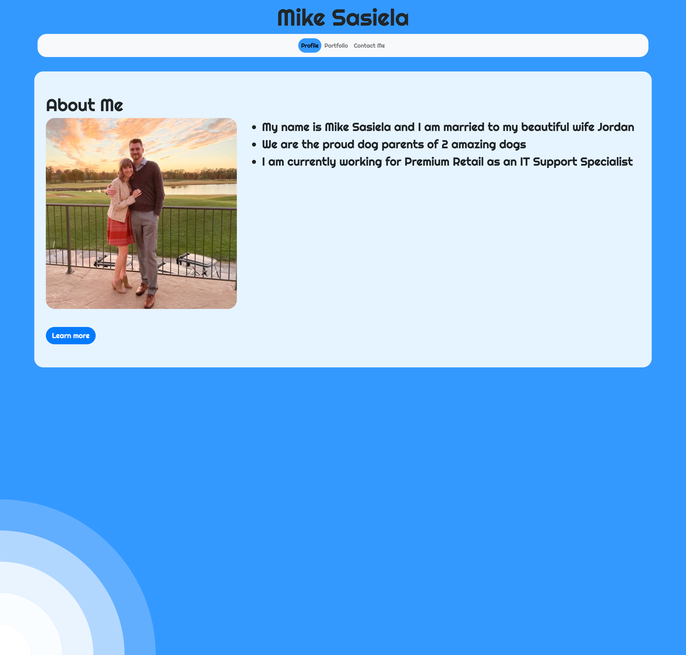
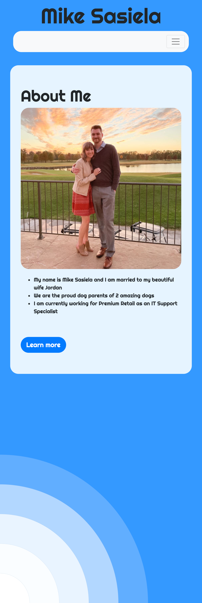

# My-Portfolio

## Completed Web Page

The following image shows the completed web application's appearance and functionality:







## Functionality of Webpage

```
Fully functional webpage with working links and a mobile responsive layout using bootstrap. 

Can view Profile, Portfolio, and contact pages by clicking on navbar links.

'Learn More' button on Profile page opens a new tab to my linkedin page

'Submit' button on contact page opens up default email program/application. 
    Email unfortunately does not contain the information typed out at this time.
    Working to fix this issue in the future.

Social links in footer all open new tabs to my profile on each respective website.

When looking at the website on mobile the navbar turns into a mobile friendly navbar with working burger menu button.

Profile page has mobile responsive rows of images.
    Images get bigger and rows split from 4 images to 2 to 1 based on screen size.

```

## Link to Webpage 
[My Portfolio](https://msas12.github.io/My-Portfolio/)